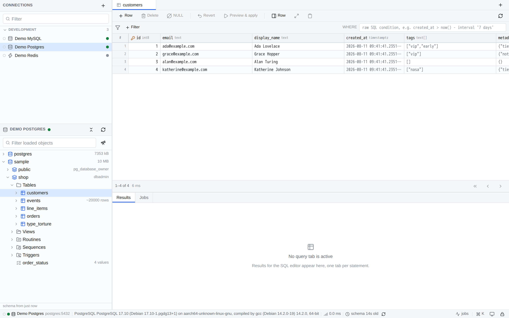
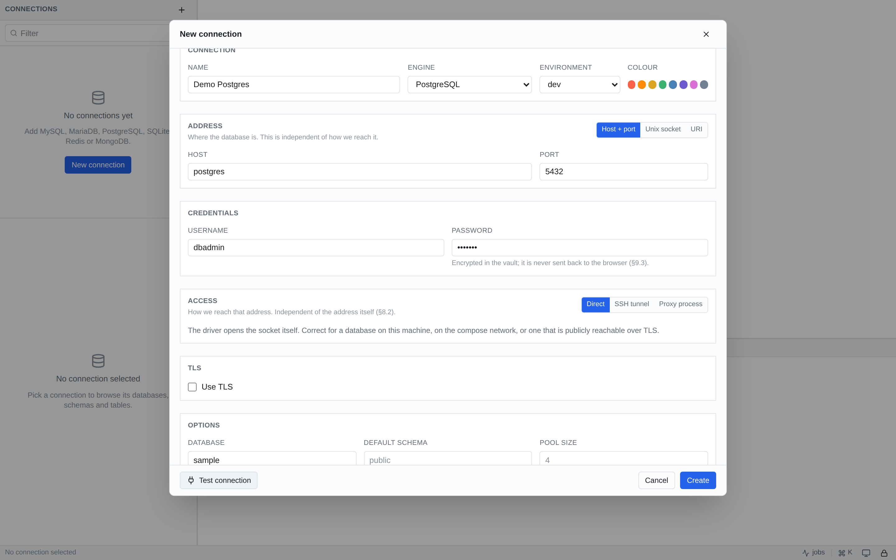
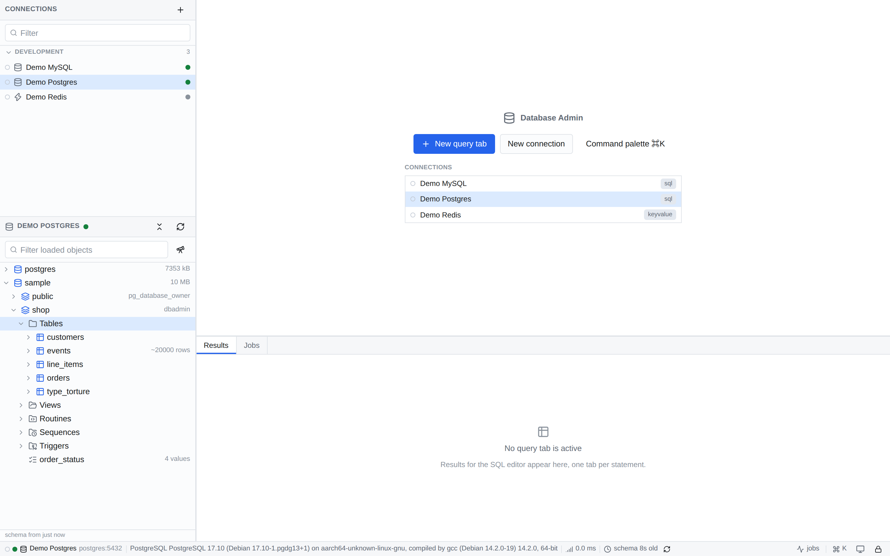

# Database Admin

A DataGrip-style database client that runs as a local web app **in Docker**.
One tool for **MySQL, MariaDB, PostgreSQL, SQLite, Redis and MongoDB** — local or remote.

Built to [PLAN.md](PLAN.md); every non-obvious decision in the code cites the section it implements.



<details>
<summary>More screenshots</summary>

**Connecting.** Where the database is and how you reach it are separate choices, so a direct
connection and one through a bastion differ only in the Access section.



**The object tree.** Databases, schemas, tables, views, routines, sequences, triggers and enums —
virtualised, so a schema with hundreds of tables stays responsive.



**First run.** Accounts are local to the machine; connections are private to the account that
created them.


</details>

---

## Quick start

You need Docker. You do **not** need Node installed — everything builds and runs inside the container.

```bash
# App plus all five database engines to play with
docker compose -f compose.dev.yml --profile dbs up

# App only (production image)
docker compose up --build
```

Then open:

```
http://127.0.0.1:3456/
```

Prefer to run it directly on your machine? See [Running without Docker](#running-without-docker) —
it needs Node 22 and gives up the bundled dump tools, but local databases get simpler.

Sign in, or create an **account** from the link on the sign-in screen. Accounts exist only on this
machine, in `accounts.json` under `DBADMIN_HOME` — nothing is registered anywhere.

That one password does two jobs. It signs you in, and it derives the AES-256-GCM key that encrypts
your saved database credentials. The two are derived with *different* salts, so the verifier stored
on disk is not the encryption key and cannot be turned into it. The key itself lives in server
memory only and is never written to disk — which is why signing in is what unlocks the vault, and
why a restart asks for the password again.

**Forget the password and that account's saved credentials are gone.** There is no recovery, by
design.

Sign out from the status bar or the command palette (`⌘K`). It drops the session, locks your vault
and closes your open connections — other signed-in users are unaffected.

### Multiple accounts

Sign-up is open: anyone who can reach the port can create an account. The port is bound to
`127.0.0.1`, so in practice that means local processes and anyone with a shell on this machine.

**Connections are private to the account that created them.** That is enforced twice over:

- every query, cache and connection pool is scoped to the signed-in user, and
- each account has its own vault, so another user's saved credentials are not merely hidden from
  the list — they are encrypted under a key that only their password derives.

`tests/e2e/user-isolation.mjs` fires every connection-taking endpoint from the wrong account and
fails on any response that carries data.

### Why an account rather than "just localhost"

Any website you visit can issue requests to this port. The session cookie is `HttpOnly` and
`SameSite=Strict`, so a request originating from another site never carries it — that, plus strict
`Origin`/`Host` validation, is what stops both CSRF and DNS rebinding.

---

## Connecting to a database

**This is the one thing worth reading before you start.** The app runs inside a container, so
`localhost` means *the container*, not your machine. Three cases:

| Your database is… | Use this host |
| --- | --- |
| On your Mac/PC | `host.docker.internal` |
| In another container | its service name (join the same network) |
| Remote | the real hostname |

The connection form detects `localhost`/`127.0.0.1` and offers a one-click fix, so you do not have to
remember this. With `--profile dbs`, the bundled engines are reachable by service name:

| Engine | Host | Port | User / password |
| --- | --- | --- | --- |
| MySQL | `mysql` | 3306 | `dbadmin` / `dbadmin` |
| MariaDB | `mariadb` | 3306 | `dbadmin` / `dbadmin` |
| PostgreSQL | `postgres` | 5432 | `dbadmin` / `dbadmin` |
| Redis | `redis` | 6379 | — |
| MongoDB | `mongo` | 27017 | `dbadmin` / `dbadmin` |
| SQLite | a file under `/data/sqlite` | — | — |

### Remote databases

- **Direct TCP** with TLS (`verify-full`, `require`, or `skip` — which the UI tells you plainly is
  vulnerable to MITM).
- **SSH tunnel**, including bastion/`ProxyJump` chains, ssh-agent, and `~/.ssh/config` aliases.
  Your `~/.ssh` is mounted read-only. For agent auth on Docker Desktop, the agent socket is bridged
  at `/run/host-services/ssh-auth.sock`.
- **Proxy process** — `kubectl port-forward`, `cloud-sql-proxy`, and friends.

Connectors never know how they were reached: the access layer resolves first and hands them an
already-dialable address. That is why the bundled `mysqldump`/`pg_dump` work through a tunnel too.

### Unix sockets

Supported on Linux. **Not** on macOS — Docker Desktop does not proxy bind-mounted unix sockets from
the host, so local connections there go over TCP via `host.docker.internal`. The form says so rather
than failing mysteriously.

---

## Volumes

Every path in the UI is a **container** path. The file pickers show which host directory each maps to.

| Container path | What it holds | Host default |
| --- | --- | --- |
| `/data/app` | connections, history, saved queries, job records | named volume `dbadmin-data` |
| `/data/sqlite` | SQLite databases you want to open | `./data/sqlite` |
| `/data/exports` | export destination (writes are confined here) | `./data/exports` |

Override the host side with `DBADMIN_SQLITE_DIR` and `DBADMIN_EXPORT_DIR`.

Back up `/data/app` and you have backed up the whole app.

---

## What it does

**Browse** — lazy object tree (databases → schemas → tables → columns/indexes/keys, routines,
sequences, triggers, enums), virtualized data grid with server-side paging, sorting and filtering,
and viewers for JSON, binary and images.

**Query** — CodeMirror editor with schema-aware autocomplete (including table aliases), run
statement-under-cursor / selection / whole script, multiple result tabs, real cancellation, pinned
transaction sessions, and searchable history.

**Edit** — inline cell editing accumulates into a changeset; *Preview* shows the exact SQL and the
rows each statement should touch; *Apply* runs it in one transaction and aborts on an affected-rows
mismatch. Table, index and foreign-key editors generate DDL — for SQLite, honestly presented as the
12-step rebuild it actually is.

**Import / export** — result sets, tables, whole databases or the whole server, to CSV/TSV/JSON/
NDJSON/XLSX/Markdown/HTML/SQL, optionally gzipped. CSV import has a mapping wizard with a dry run.
Fast paths (`COPY FROM STDIN`, `LOAD DATA`, `bulkWrite`) are used where available. Long transfers run
as background jobs with live progress, a log tail and cancel — and survive a page reload.

**Redis** — SCAN-based keyspace browser (never `KEYS *`), type-aware editors for every value type,
TTL control, a real CLI console, and live `MONITOR` / pub-sub.

**MongoDB** — collection browser, table *and* document views, Extended JSON filters, an aggregation
pipeline builder with explain, and index management.

**Power tools** — ER diagram, EXPLAIN visualizer with a flame view, live session/process monitor,
and schema compare that generates an ordered migration script with destructive statements quarantined
behind an explicit opt-in.

---

## Safety

- Published on `127.0.0.1` only. Docker's port publishing bypasses host firewalls, so the bind
  address is the real control — never change it to `${DBADMIN_PORT}:${DBADMIN_PORT}` without the
  `127.0.0.1:` prefix. Default port is **3456**; override with `DBADMIN_PORT`.
- Account sign-in with an `HttpOnly`, `SameSite=Strict` session cookie, plus strict `Origin`/`Host`
  validation on every API request. Reads are checked as strictly as writes.
- Credentials encrypted at rest under a per-account key; passwords never travel back to the browser.
- Connections, query history, saved queries and workspace layout are private per account.
- Identifiers are always quoted through a per-engine function, never concatenated.
- `DROP`, `TRUNCATE` and unqualified `UPDATE`/`DELETE` require typed confirmation.
- Connections tagged `prod` get a red header and stricter confirmations, and can be marked read-only
  (enforced both server-side and by statement classification).

---

## Development

```bash
docker compose -f compose.dev.yml --profile dbs up   # HMR, source bind-mounted
docker compose -f compose.dev.yml exec devapp npm run typecheck
docker compose -f compose.dev.yml exec devapp npm test
```

The dev service is `devapp`, while `compose.yml`'s is `app`. Both files share the project name
`database-admin`, so identical service names would mean one shared container — and starting the
engines from this file would kill a running production app. Point browser E2E at
`APP_URL=http://devapp:3456` when driving this stack; the default targets `app`.

`node_modules` lives in a named volume so Linux-built native modules are never shadowed by a
host-built directory. Never copy `node_modules` from the host into the image.

Tests run against real engines via testcontainers — introspection SQL cannot be meaningfully unit
tested. They run on the host or in CI, not inside the app container, which would need the Docker
socket mounted.

---

## Running without Docker

Docker is the supported path, but nothing stops you running the app directly on the host. Node 22
or newer is required (`"engines": { "node": ">=22" }`).

```bash
npm install

npm run dev      # tsx watch, HMR, http://127.0.0.1:3456
# or
npm run build    # next build
npm start        # production server, same port
```

`npm run typecheck`, `npm test` and `npm run lint` work the same way.

### What gets easier

**`localhost` means your machine again.** There is no container boundary, so a database on this
host is reachable at `localhost:5432` directly — `host.docker.internal` is neither needed nor
resolvable. The app detects this and stops offering the rewrite hint.

**ssh-agent works properly.** `SSH_AUTH_SOCK` is the real one rather than Docker Desktop's bridged
socket, so agent authentication for SSH tunnels works without the `/run/host-services` mount that
only exists under Docker Desktop.

Remote databases are otherwise unchanged: every driver (`mysql2`, `pg`, `mongodb`, `ioredis`) and
the SSH implementation (`ssh2`) is pure JavaScript.

### What changes

Paths move out of `/data` and into your home directory, so a host run and a container run keep
entirely separate accounts and connections:

| | container | host |
| --- | --- | --- |
| accounts, connections | `/data/app` | `~/.dbadmin` |
| SQLite browser root | `/data/sqlite` | `~/sqlite` |
| export destination | `/data/exports` | `~/dbadmin-exports` |

Override with `DBADMIN_HOME`, `DBADMIN_SQLITE_ROOT` and `DBADMIN_EXPORT_ROOT`. The server also
binds `127.0.0.1` instead of `0.0.0.0`, since there is no container network to publish from.

### Native dump tools are not included

The image bakes in every dump/restore binary (§10.1); your host almost certainly has none of them.
Without them the **native** dump and restore paths fail with a clear error — the built-in streaming
export (CSV, JSON, XLSX, SQL) is pure JavaScript and keeps working regardless.

```bash
brew install postgresql@17 mongodb-database-tools redis sqlite
brew install mysql-client
```

`postgresql@17` needs no PATH changes — the detector scans `/opt/homebrew/opt/postgresql@*/bin`
directly and picks the right major per connection, since `pg_dump` must be at least the server's
version. Install several majors side by side if you dump from several servers.

Everything else is found on `PATH` only, and `mysql-client` is keg-only, so it needs:

```bash
export PATH="/opt/homebrew/opt/mysql-client/bin:$PATH"
```

### Engines to develop against

Running the app on the host does not mean running databases there. The simplest combination is
host app plus containerised engines:

```bash
docker compose -f compose.dev.yml --profile dbs up -d mysql mariadb postgres redis mongo
```

They publish on `127.0.0.1` at the ports `tests/helpers/engines.ts` already defaults to, so
`npm test` finds them with no configuration.

### One rule

Never let a host-built `node_modules` reach the image. macOS-built native modules do not run on
Linux, which is why `node_modules` is the first line of `.dockerignore`. Building the image from a
tree you have run `npm install` in is safe — the ignore file handles it — but never copy the
directory in by hand.

---

## Layout

```
src/lib/        contracts shared by client and server (wire format, SchemaModel, API types)
src/server/     zero React imports — connectors, access resolver, jobs, transfer engine
  db/connectors/{sqlite,mysql,postgres,redis,mongo}
  net/          AccessResolver: tunnels, proxies, port allocation
  jobs/         background job manager
  transfer/     export writers, import fast paths, native tool wrappers
src/app/        routes and API handlers
src/components/ shell, tree, grid, editor, redis, mongo, transfer, power tools, ddl
server.ts       http + Next handler + WebSocket upgrade
```

`src/server/**` imports no React and no Next types, so it can be lifted into a package or an Electron
main process later without touching a line.

---

## Contributing

Contributions are welcome. [CONTRIBUTING.md](CONTRIBUTING.md) covers getting a working copy, the
checks to run before opening a pull request, and a handful of things that are easy to get wrong
here — the two compose files sharing a project name, and never hardcoding your own connection names
into the end-to-end tests.

Found a security issue? Please read [SECURITY.md](SECURITY.md) and report it privately rather than
opening a public issue — this tool holds database credentials.

## Licence

[MIT](LICENSE) © Md Abdul Majid
